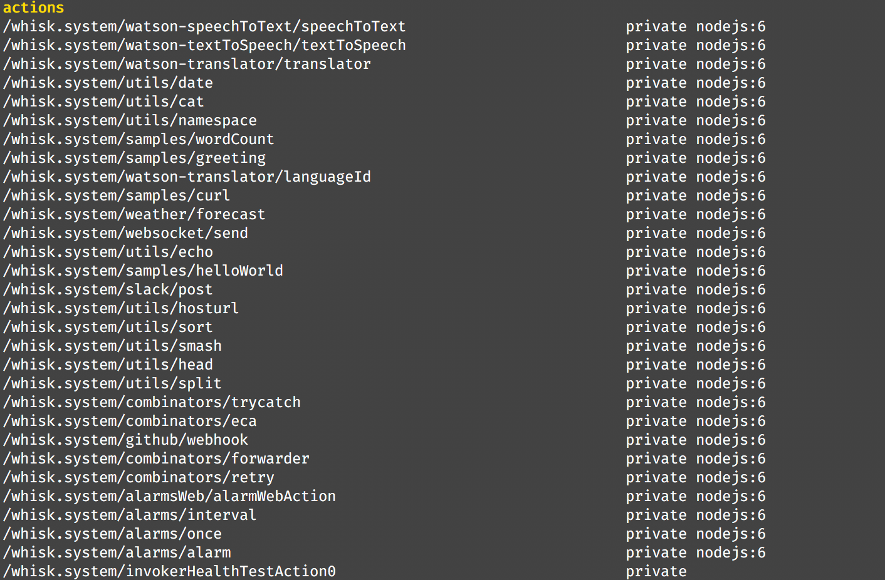

# Setup Apache OpenWhisk on OpenShift

Having prepared the [OpenShift Container Platform](https://openshift.com]) environment to deploy [Apache OpenWhisk](https://openwhisk.apache.org/), in this scenario we will deploy [Apache OpenWhisk](https://openwhisk.apache.org/) to the [OpenShift Container Platform](https://openshift.com]).

**1. Deploy OpenWhisk**

Make sure we are in `faas` project:

``oc project -q``{{execute}}

Deploy OpenWhisk to OpenShift:

``oc process -f https://git.io/openwhisk-template | oc create -f -``{{execute}}

**2. Wait for Pods to be Deployed**

The previous step takes a bit of time to get ready as [Apache OpenWhisk](https://openwhisk.apache.org/) has several applications to be deployed.  You can watch the status via the following command:

``oc logs -f controller-0 -n faas | grep "invoker status changed"``{{execute}}

or

You can also see the status via OpenShift Console:

 

by navigating to `FaaS- Apache OpenWhisk` project.  Successful `controller` deployment should look like:

**IMPORTANT**

Please proceed to next step if and only if the `controller` is ready.

**3. Edit OpenWhisk Ngnix Route TLS**
TODO: update to a better description

By default the OpenWhisk nginx route is configured to do "Redirect" for edge termination.  In Katacoda all the requests are secured so we need to modify nginx route `openwhisk` insecureEdgeTerminationPolicy to "Allow"

``oc patch route openwhisk --namespace faas -p '{"spec":{"tls": {"insecureEdgeTerminationPolicy": "Allow"}}}'``{{execute}}

**4. Configure OpenWhisk CLI**

Get the default authentication and authorization credentials:

``AUTH_SECRET=$(oc get secret whisk.auth -o yaml | grep "system:" | awk '{print $2}' | base64 --decode)``{{execute}}

Set OpenWhisk CLI authentication and API Host:

``wsk property set --auth $AUTH_SECRET --apihost $(oc get route/openwhisk --template="{{.spec.host}}")``{{execute}}

You can verify the settings via the command:

``wsk -i property get``{{execute}}

**5. Verify OpenWhisk CLI setup**

``wsk -i action list``{{execute}}

Successful execution of the above command should display output like below:

## Congratulations

You have now deployed [Apache OpenWhisk](https://openwhisk.apache.org/) to the [OpenShift Container Platform](https://openshift.com]). 

In next step of this scenario, we will write a simple Java function, deploy it to OpenWhisk and invoke the same to verify that we are in good shape to continue our FaaS journey.